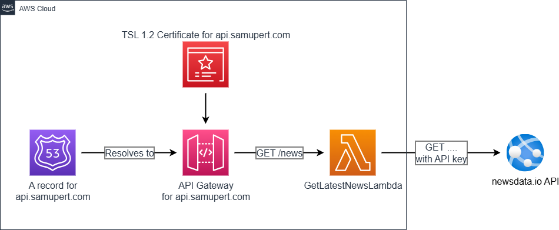
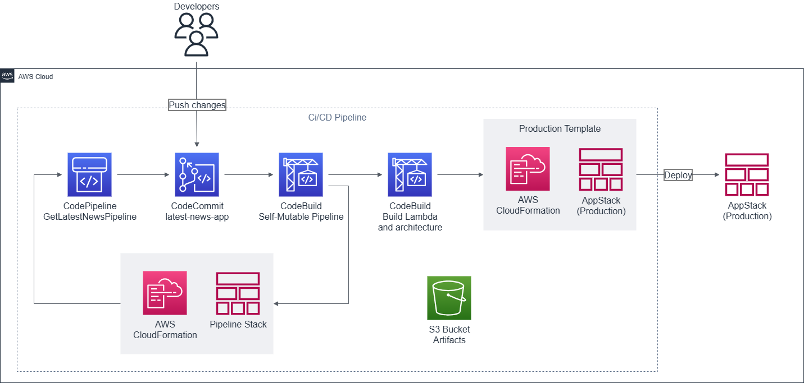

# Get-Latest-News App - PoC

This is a simple proof-of-concept application that demonstrates the use of **AWS CDK** and a **self-mutating CI/CD pipeline**. The application fetches the latest news from an external API and serves it through an AWS-hosted endpoint.

> ⚠️ **Note**: This app is **not intended for production use**. It serves purely as a demonstration of AWS infrastructure automation and deployment techniques.

---

## ✨ Features

* Fetches the latest news from an external API via AWS Lambda.
* API exposed through Amazon API Gateway.
* Automatically provisions the following using AWS CDK:

  * Custom domain name with Route 53 record
  * HTTPS certificate via AWS Certificate Manager
  * API Gateway setup with domain association
  * Lambda function setup and permissions
* Self-mutating CI/CD pipeline to deploy infrastructure and code changes.

---

## 🛠 Architecture Overview

---

## 🔁 CI/CD Pipeline

The pipeline is defined and deployed using CDK itself, enabling self-mutation and automated updates to the infrastructure with every commit.

---

## 📄 License

MIT – see [LICENSE](./LICENSE.md) for more information.
